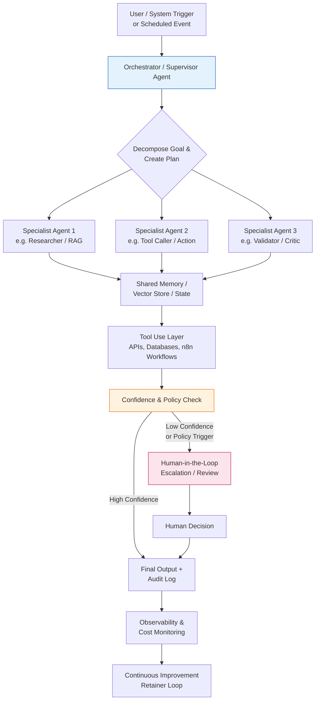

> **⚠️ EDUCATIONAL PURPOSE ONLY**  
> This document describes technology trends and architectural patterns observed in 2026. It is **not** technical, legal, or implementation advice. AI capabilities, costs, security best practices, and tooling evolve rapidly. Non-deterministic systems carry inherent risks (hallucinations, cost overruns, data leakage). Always validate architectures, security controls, and ROI claims with real client data, current vendor documentation, and qualified technical/legal review. “Results vary. Always validate with real clients.”

---

# 2026 Trends: From Basic Chatbots to Agentic Orchestration

**The decisive shift in 2026 is not “more powerful LLMs” — it is moving from brittle, single-turn chatbots to reliable, multi-agent systems that can plan, use tools, retrieve context, collaborate, and escalate to humans when needed.**

This file explains why that shift matters for anyone building an AI Automation / Agent Agency and how to position your services accordingly.

## Why This Exists

Early AI agency work (2023–early 2025) often centered on building conversational chatbots or simple Zapier/Make automations wrapped in an LLM. Many of these efforts produced high-maintenance, low-reliability systems that failed to deliver consistent business outcomes and created ongoing support burdens.

By 2026, successful agencies have moved to **agentic orchestration**: coordinated teams of specialized AI agents that handle complex, multi-step workflows with memory, retrieval-augmented generation (RAG), tool use, and human-in-the-loop (HITL) oversight. This model aligns with retainer-based services because it produces measurable, ongoing value rather than one-off prompts.

This file gives you the conceptual foundation so you can explain the shift to clients, choose appropriate technology, design reliable services, and avoid the pitfalls that sank many early chatbot projects.

## How to Use This File

1. Read the full explanation of the architectural shift.
2. Study the Mermaid diagram to internalize the components of a modern agentic system.
3. Use the security guidance when selecting models and infrastructure for client work.
4. Reference the pitfalls section when scoping projects or educating clients.
5. Apply the concepts when designing services in `03_Services_Pricing_and_Packaging/` and building workflows in `04_Tech_Stack_Build_Guides_and_Examples/`.

## How It Connects to Other Sections of the Kit

This trends document is the “why” behind the kit’s technical and service recommendations. It directly informs:
- **03_Services_Pricing_and_Packaging/** — Why Discovery + Implementation + Retainer packaging works better than one-off chatbot builds.
- **04_Tech_Stack_Build_Guides_and_Examples/** — Why n8n (with strong multi-agent, RAG, and tool nodes) is positioned as the primary orchestration layer, and how to evaluate other tools.
- **05_SOPs_Delivery_Workflows_and_QA/** — Why QA protocols must test for hallucinations, cost control, fallback behavior, and HITL escalation paths.
- **06_Sales_Marketing_and_Acquisition/** — How to articulate the difference between “we’ll build you a chatbot” and “we’ll deploy reliable digital team members that improve your operations month after month.”
- **07_Legal_Compliance_Operations/** — Data handling and liability considerations are heightened when agents access tools and client systems.

It also reinforces the core philosophy stated in the README: **process-first discovery before building** and **systems thinking over hype**.

---

## The Architectural Shift in 2026

### From Basic Chatbots (2023–2024 Style)

Typical early implementations looked like this:

- Single LLM call (or short conversation) triggered by a webhook or form.
- Simple prompt + optional retrieval from a vector store.
- Output returned directly to the user or written to a spreadsheet/CRM.
- Minimal memory across sessions.
- Little or no planning, tool use, or error recovery.
- Human oversight was usually “read the output and fix it manually.”

**Common outcomes**: Brittle behavior on edge cases, high hallucination rates on complex tasks, unpredictable costs, and client frustration when the system “broke” on real-world variability. Many of these projects became ongoing maintenance nightmares rather than scalable retainer assets.

### To Agentic Orchestration (2025–2026 Reality)

Modern systems treat AI as **coordinated teams of digital workers** rather than a single smart chatbot. Key characteristics:

- **Multi-agent collaboration** — A supervisor or router agent decomposes goals and delegates to specialist agents (researcher, writer, validator, tool caller, etc.).
- **Memory & state** — Short-term working memory + longer-term vector or graph memory so agents remember context across steps and sessions.
- **RAG (Retrieval-Augmented Generation)** — Agents dynamically pull relevant, up-to-date information from client documents, databases, or APIs instead of relying only on parametric knowledge.
- **Tool use & action** — Agents can call APIs, update CRMs, send emails, query internal systems, or trigger other workflows — safely and with proper permissions.
- **Planning & reflection loops** — Agents can create plans, execute steps, critique their own output, and iterate before final delivery.
- **Human-in-the-Loop (HITL)** — Clear escalation paths when confidence is low, policy requires human approval, or the task exceeds current agent capability.
- **Observability & cost control** — Logging, tracing, token usage monitoring, and fallback mechanisms are built in from day one.

This architecture produces more reliable outcomes on complex operational workflows (lead qualification + routing + follow-up, client onboarding sequences, support triage with knowledge base lookup, recurring reporting, etc.). It is also far more suitable for **retainer relationships** because the agency can continuously improve the agents, monitor performance, and deliver compounding value.

**[CUSTOMIZE FOR YOUR NICHE]** — In landscaping operations, an agentic system might coordinate weather-aware scheduling, crew assignment, inventory checks, and customer notifications. In a law firm it might handle intake, conflict checking, document drafting with precedent retrieval, and deadline tracking — all with appropriate human review gates.

---

## Recommended Architecture (2026)

### Key layers explained:

1. **Orchestrator** manages goal decomposition and routing.
2. **Specialist agents** focus on narrow, high-skill tasks.
3. **Shared memory + RAG** gives agents access to client-specific knowledge without retraining models.
4. **Tool layer** (often powered by n8n or similar) executes real actions safely.
5. **HITL gate** protects quality and compliance.
6. **Observability** enables the agency to monitor, improve, and prove ROI on retainer.

This pattern (or close variants) is what leading 2026 automation agencies are deploying for repeatable, high-value operational workflows.

## Secure Model Selection Guidance

When agents handle client data, internal documents, or take actions in client systems, security and data residency become non-negotiable.
Prioritize enterprise-grade data privacy endpoints over consumer-grade chat interfaces:

* **Preferred for client work:** Azure OpenAI, Anthropic Enterprise, Google Vertex AI with data controls, or self-hosted / VPC-deployed models (where latency and cost allow).
* **Consumer ChatGPT / Claude.ai interfaces:** Generally unsuitable for client data or production agent loops due to training data usage, lack of enterprise SLAs, and limited auditability.
* **Hybrid approach (common in 2026):** Use frontier models via enterprise APIs for reasoning/planning, and route simpler or more sensitive tasks to smaller, self-hosted, or fine-tuned models.

Additional safeguards to implement:

1. Never send raw PII or sensitive client data to models without proper redaction, anonymization, or contractual data processing agreements.
2. Use environment variables and secret managers (never hard-code keys).
3. Log all agent actions and model calls for auditability.
4. Implement tool-level permission boundaries (an agent should only be able to call the tools it is explicitly authorized to use).
5. Regularly review model provider terms regarding data retention and training.

This guidance aligns with the compliance checklist in `07_Legal_Compliance_Operations/compliance-checklist.md`.

## Common Pitfalls & Mitigations (2026)

| Pitfall | Why It Happens | Mitigation |
|:---|:---|:---|
| Treating multi-agent systems as “just more prompts” | Underestimating coordination, state management, and error propagation complexity | Invest in proper orchestration frameworks (n8n + agent nodes, LangGraph-style patterns, etc.) and thorough testing |
| Ignoring cumulative token costs in long-running loops | Agents can make many calls during planning + reflection + tool use | Implement token budgets, caching, prompt compression, and real-time cost monitoring from day one |
| Weak or missing HITL escalation | Over-trusting agent output on high-stakes tasks | Define clear confidence thresholds and policy rules; make human review the default on sensitive actions |
| Building agents before mapping the underlying process | Automating broken or poorly understood workflows | Always start with process discovery and measurement (see `05_SOPs_Delivery_Workflows_and_QA/`) |
| Insufficient observability | Inability to debug why an agent took a wrong path or cost too much | Mandate structured logging, tracing, and dashboards as part of every deployment |
| Data leakage through tool calls or memory | Agents given overly broad access to client systems | Apply least-privilege principles to every tool and memory store |

These pitfalls are why the kit emphasizes process-first discovery, rigorous QA protocols, and retainer models that include ongoing monitoring and improvement.

## Actionable Takeaways for Agency Builders

- Stop selling “we’ll build you an AI chatbot.” Start selling reliable digital team members that improve specific operational outcomes month after month.
- Design every service offering around the agentic pattern shown in the Mermaid diagram (orchestration + specialists + RAG + tools + HITL + observability).
- Choose your primary orchestration layer (n8n is the kit’s recommended starting point for most founders because of its balance of visual development, code extensibility, self-hosting, and growing AI/agent capabilities) and master its multi-agent and tool patterns.
- Make security and data governance part of the sales conversation, not an afterthought.
- Use retainers to continuously refine agent behavior, reduce costs, and expand coverage — this is where the real 2026 competitive advantage lies.

**[CUSTOMIZE FOR YOUR NICHE]** — Map one core workflow in your chosen vertical (e.g., “new client intake and matter setup for a law firm” or “daily crew scheduling and job completion reporting for a landscaping company”) onto the architecture above. This exercise will make every subsequent scoping conversation dramatically clearer.

This document gives you the mental model. The rest of the kit shows you how to operationalize it.

Next step: Move to `04_Tech_Stack_Build_Guides_and_Examples/tech-stack-comparison.md` to see concrete tool recommendations that support the architecture described here, or jump to the service catalog in Module 3 once you have internalized the shift.

Welcome to agentic orchestration in 2026.
