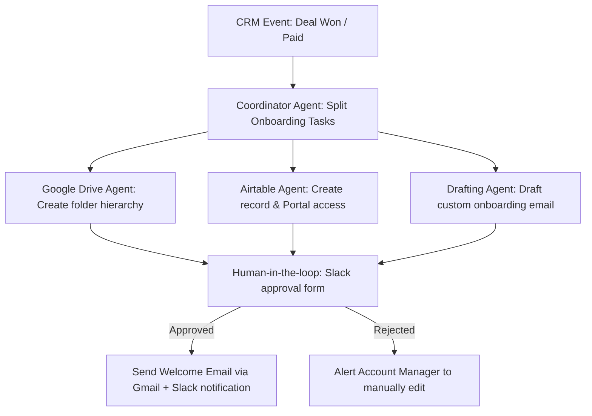

# Client Onboarding Multi-Agent Flow (n8n Workflow Guide)

**Module 4: Tech Stack Build Guides and Examples**

## Why This Exists

The first 30 days of a client engagement determine retention. In high-value service businesses, manual onboarding is error-prone and slow—contracts get delayed, welcome emails are sent late, and shared folders are inconsistently organized.

This guide details a **Client Onboarding Multi-Agent Flow** built in n8n. The system triggers immediately upon a deal winning in your CRM, orchestrating multiple sub-agents to spin up client files, generate portals, and draft custom onboarding emails with human oversight.

---

## High-Level System Logic



---

## Detailed Step-by-Step Node Configuration

### Step 1: Trigger Node (CRM / Stripe webhook)
* **Node Type:** Webhook Node (or native CRM node like Clio/Jobber/HubSpot)
* **Trigger Event:** Opportunity status updated to "Closed Won" or Stripe event `checkout.session.completed`.
* **Payload Example:**
  ```json
  {
    "client_name": "Acme Office Parks",
    "contact_email": "facilities@acme.com",
    "contract_value": 72000,
    "service_tier": "Implementation + Retainer",
    "onboarding_notes": "Client requested Friday morning service window if possible."
  }
  ```

### Step 2: Coordinator Agent (n8n Agent Node)
* **Node Type:** AI Agent Node
* **Model:** Claude 3.5 Sonnet
* **Role:** Coordinating Coordinator Agent
* **Task:** Parse the contract details and execute onboarding tasks in parallel. Route to tools for directory setup, database logging, and content drafting.

### Step 3: Google Drive Agent Node (Tool 1)
* **Node Type:** Google Drive Node
* **Action:** Create Folder
* **Parameters:**
  * **Folder Name:** `[Acme Office Parks] Onboarding & Assets`
  * **Subfolders:** `01_Contracts_and_Agreements`, `02_Workflows_and_IP`, `03_Operations_and_Reports`
* **Output:** `folder_id` (passed back to the coordinator)

### Step 4: Airtable Portal Agent Node (Tool 2)
* **Node Type:** Airtable Node
* **Action:** Append Record
* **Parameters:**
  * **Base:** "Client Directory"
  * **Table:** "Onboarding Portals"
  * **Fields:** 
    * Company Name: `{{ $json.client_name }}`
    * Email: `{{ $json.contact_email }}`
    * Shared Folder URL: `{{ $('Google Drive Node').item.json.webViewLink }}`
    * Status: `Pending Onboarding Info`
* **Output:** `portal_record_id`

### Step 5: Onboarding Draft Agent Node (Tool 3)
* **Node Type:** AI Agent Node
* **Model:** GPT-4o
* **Goal:** Draft a highly personalized welcome email.
* **System Instruction:**
  ```text
  Draft a professional, warm welcome email to {{ $json.client_name }} ({{ $json.contact_email }}).
  Include the following details:
  - Reference their service tier: {{ $json.service_tier }}.
  - Provide a link to their shared Google Drive folder: {{ $('Google Drive Node').item.json.webViewLink }}.
  - Reassure them that we are addressing their special note: "{{ $json.onboarding_notes }}".
  - Do NOT send the email yet. Format it as an email draft ready for review.
  ```

### Step 6: Human-in-the-Loop Slack Gate
* **Node Type:** Slack Node (Interactive Message)
* **Action:** Post message with interactive buttons (Approve / Reject).
* **Message Body:**
  ```text
  🚨 New Client Onboarding Assets Ready for Review:
  Client: {{ $json.client_name }}
  Drive Folder: Deployed successfully
  Draft Email:
  "{{ $('Onboarding Draft Agent Node').item.json.email_draft }}"

  Please approve to send, or reject to edit manually.
  ```

### Step 7: Final Execution Node
* **If Approved:** Sends draft welcome email via Gmail/Outlook API to the client, updates the Airtable Portal status to `Active`, and posts a success message to the internal Slack `#operations` channel.
* **If Rejected:** Triggers a Slack message pinging the account manager to handle setup manually.

---

## Technical Cost & Performance Safeguards

1. **Transaction Caching:** Onboarding workflows only execute once per client. Implement a hashing check (e.g., using Redis or Airtable record lookups) to prevent duplicate runs if the CRM webhook fires twice.
2. **Error Isolation:** If the Google Drive API fails due to permission blocks, the workflow should not abort. The Airtable logging and email drafting should continue, and a specialized Slack alert should flag only the Drive setup failure.
