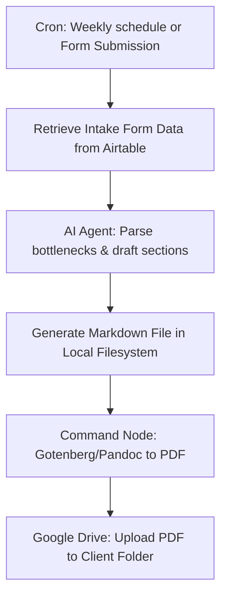
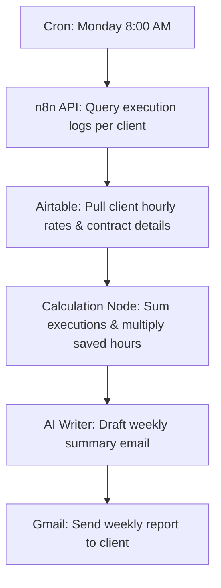

# Internal Agency Automation (n8n Workflow Guide)

**Module 4: Tech Stack Build Guides and Examples**

## Why This Exists

Profitable AI Automation Agencies practice what they preach. If you build automation for clients but run your own agency operations manually, you will face delivery bottlenecks. 

This guide details two internal automation templates in n8n designed to streamline your business: **Automated Discovery Audit Report Generator** and **Weekly Client Account ROI Digests**.

---

## 1. Automated Discovery Audit Report Generator

This workflow automates the creation of the primary PDF deliverable for the **Discovery & Audit Package** (Tier 1).

### Detailed Setup
* **Trigger:** Airtable record updated to status `Ready for Audit`.
* **AI Parser:** Anthropic Claude 3.5 Sonnet extracts manual bottlenecks, current software systems, and team size, and outputs a formatted Markdown file structure containing a customized 90-day roadmap.
* **PDF Compilation:** n8n passes the Markdown file to a self-hosted `Gotenberg` Docker container or runs a system command using `Pandoc` to convert the markdown into a styled PDF.
* **File Delivery:** Google Drive node uploads the PDF to the client's shared folder and writes the link back to Airtable, changing status to `Audit Deployed`.

---

## 2. Weekly Client Account ROI Digests

This workflow compiles system execution logs for each client, calculates hours and money saved, and emails a weekly report to the client. This reinforces the value of your retainer model.

### Detailed Setup
* **Trigger:** Cron Node scheduled for `0 8 * * 1` (Monday 8:00 AM).
* **n8n Log Collection:** HTTP Request node queries the n8n execution API to count total successful runs for each client's workflows.
* **Airtable Directory:** Pulls the client's baseline metric fields (e.g., GreenScape saves 5 minutes per route calculation; average wage is $45/hr).
* **Formula Node:**
  $$\text{Total Hours Saved} = \text{Executions} \times \frac{\text{Minutes Saved per Run}}{60}$$
  $$\text{Financial Value} = \text{Total Hours Saved} \times \text{Hourly Wage}$$
* **Content Generation:** Claude drafts a weekly update:
  *"Good morning. Last week, your daily dispatch workflows executed 168 times, saving your crew approximately 14 hours of scheduling admin. This equates to $630 in reclaimed billing efficiency."*
* **Handoff:** Gmail node sends the report directly to the client.

---

## Performance & Volume Optimization

1. **Gotenberg Container Clustering:** For heavy report generation, host a dedicated Gotenberg instance in the same Docker network as n8n to avoid VPS performance drops.
2. **API Rate Limiting:** Enforce a delay node (e.g., 500ms) between client report loops when calling the n8n API, preventing instance rate limits or database locks.
