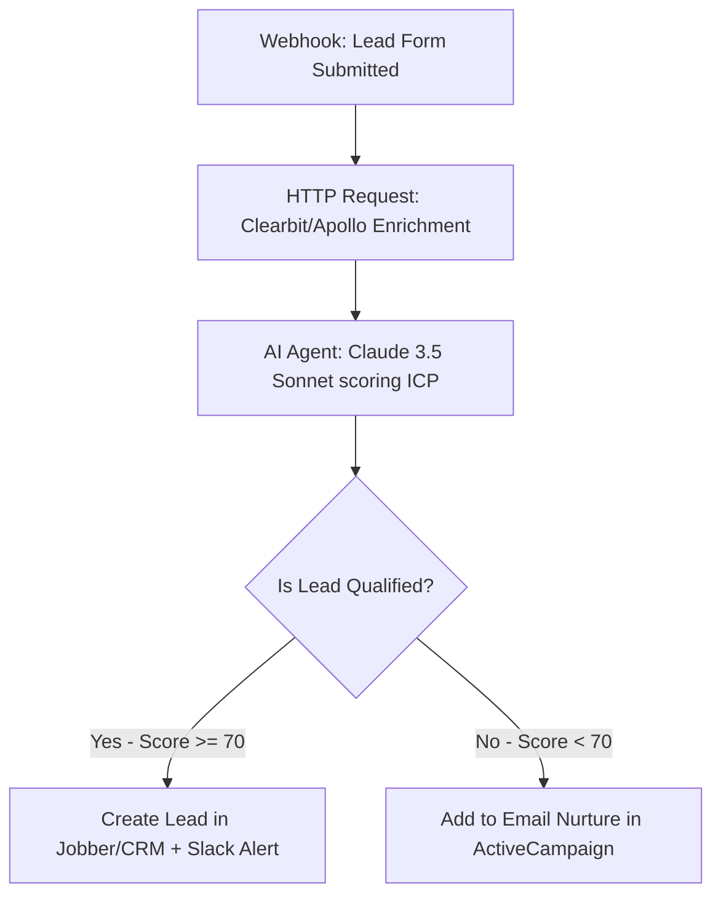

# Lead Qualification Agent (n8n Workflow Guide)

**Module 4: Tech Stack Build Guides and Examples**

## Why This Exists

In 2026, manual lead triage is a massive operational leak for field service and professional service contractors. Home services companies (like landscaping or HVAC) lose up to 35% of bookings because they fail to respond to leads within the first 15 minutes. 

This guide describes how to construct an automated **Lead Qualification Agent** in n8n. The agent intercepts new leads, enriches them with public intelligence, scores them against an Ideal Customer Profile (ICP), and routes them to CRM software or sales alerts instantly.

---

## High-Level System Logic



---

## Detailed Step-by-Step Node Configuration

### Step 1: Webhook Trigger
* **Node Type:** Webhook Node
* **HTTP Method:** `POST`
* **Path:** `/new-lead-qualification`
* **Incoming Payload Example:**
  ```json
  {
    "name": "John Doe",
    "email": "johndoe@example.com",
    "phone": "512-555-0199",
    "company": "Doe Estates",
    "service_requested": "Commercial Landscape Renovation",
    "notes": "Looking to overhaul our office park entrance. Budget around $15,000."
  }
  ```

### Step 2: Data Enrichment Node
* **Node Type:** HTTP Request
* **Endpoint:** `https://api.clearbit.com/v2/combined/find?email={{$json.email}}`
* **Method:** `GET`
* **Credentials:** Clearbit API Key (managed in n8n credentials store)
* **Goal:** Extract company size, location, and revenue to validate commercial eligibility.

### Step 3: LLM Agent Node (The Core Brain)
* **Node Type:** AI Agent (n8n 2.0+ native Agent Node)
* **Model:** Anthropic Claude 3.5 Sonnet (via Anthropic Chat Model Node)
* **Temperature:** `0.1` (low temperature to enforce consistent scoring rules)
* **System Prompt:**
  ```text
  You are an expert Lead Qualification Agent for a commercial landscaping agency (AI-Agency-Starter-Kit-2026).
  Your job is to evaluate incoming leads against our Ideal Customer Profile (ICP) and output a structured JSON response.

  Our ICP criteria:
  - Niche: Commercial properties, office parks, HOAs, or estates (not small residential yards).
  - Scope: Maintenance contracts, major overhauls, or commercial design-build.
  - Budget: Greater than or equal to $5,000.

  Evaluate the following input:
  Lead Name: {{ $json.name }}
  Requested Service: {{ $json.service_requested }}
  Notes: {{ $json.notes }}
  Enriched Location: {{ $('Clearbit Node').item.json.company.geo.state }}
  Enriched Revenue: {{ $('Clearbit Node').item.json.company.metrics.annualRevenue }}

  Respond ONLY with a valid JSON object matching this schema:
  {
    "score": integer (0 to 100),
    "is_qualified": boolean,
    "classification": "Commercial" | "Residential" | "Out of Scope",
    "reasoning": "A short, 2-sentence explanation of your evaluation."
  }
  ```

### Step 4: Router Node (Branching)
* **Node Type:** Switch / Router Node
* **Rule 1:** IF `{{ $json.is_qualified }}` is `true` AND `{{ $json.score }}` is `>= 70` $\rightarrow$ Route to **Hot Path**.
* **Rule 2:** IF `{{ $json.is_qualified }}` is `false` OR `{{ $json.score }}` is `< 70` $\rightarrow$ Route to **Nurture Path**.

### Step 5: Action Nodes
* **Hot Path:**
  * **Clio / Jobber CRM Node:** Create client profile and log a new Deal with status "Ready for Estimate".
  * **Slack/Teams Node:** Send warning alert to sales team: *"🔥 Hot Commercial Lead: John Doe ($15,000 budget). Reason: {{ $json.reasoning }}."*
* **Nurture Path:**
  * **ActiveCampaign Node:** Add email contact and tag as `ai-qualified-nurture-commercial`.

---

## Technical Cost & Performance Safeguards

1. **Prompt Caching:** Enforce caching on the system prompt containing the ICP guidelines. This reduces token costs by approximately 45% on repeat submissions.
2. **Model Fallback:** If Anthropic API returns a `5xx` error, route the webhook to OpenAI `gpt-4o-mini` with the identical prompt structure.
3. **Budget Limit:** Set an execution cap in n8n: If total token spend on this workflow exceeds $10 in a single day, suspend automated routing, alert the agency administrator, and default all incoming leads to the manual review list.
