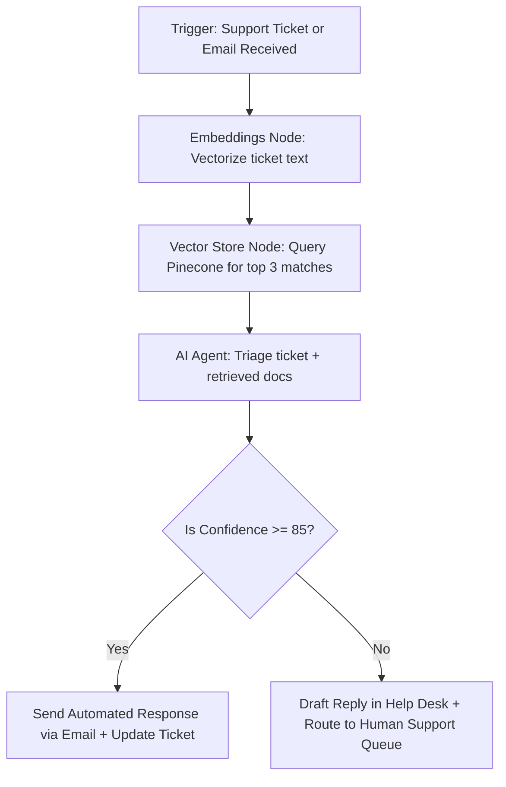

# Support Triage with RAG (n8n Workflow Guide)

**Module 4: Tech Stack Build Guides and Examples**

## Why This Exists

Providing 24/7 technical or customer support is cost-prohibitive for small companies, yet customers expect immediate replies. Standard auto-responders feel cold and rarely solve problems. 

This guide outlines a **Support Triage Workflow with RAG (Retrieval-Augmented Generation)** in n8n. The system parses support inquiries, semantically queries a vector database (like Pinecone or Qdrant) of company guidelines and documentation, drafts an accurate response, and decides whether to auto-reply or escalate to a human operator.

---

## High-Level System Logic



---

## Detailed Step-by-Step Node Configuration

### Step 1: Webhook Trigger
* **Node Type:** Webhook Node (or native Gmail / Zendesk / ServiceTitan node)
* **Payload Example:**
  ```json
  {
    "ticket_id": "TK-9021",
    "customer_name": "Sarah Miller",
    "customer_email": "smiller@example.com",
    "subject": "Invoicing error on last week's maintenance",
    "message": "I was billed $450 for lawn service, but my contract states $350. Please check my account."
  }
  ```

### Step 2: Vector DB Retriever Node
* **Node Type:** Vector Store / Pinecone Node
* **Action:** Retrieve Documents
* **Embeddings Model:** OpenAI `text-embedding-3-small` (via OpenAI Embeddings Node)
* **Search Query:** `{{ $json.subject }} - {{ $json.message }}`
* **Top K:** `3` (retrieves the top 3 most relevant contract terms or pricing guidelines)

### Step 3: AI Agent Node (Support Triager)
* **Node Type:** AI Agent Node
* **Model:** Claude 3.5 Sonnet
* **Tools:** Memory (Window Buffer Memory Node)
* **System Prompt:**
  ```text
  You are an expert customer support agent for AI-Agency-Starter-Kit-2026.
  Your goal is to answer the customer's request using the retrieved documents from our database.

  Retrieved context:
  {{ $('Pinecone Node').item.json.document_text }}

  Customer inquiry:
  From: {{ $json.customer_name }}
  Message: {{ $json.message }}

  Instructions:
  - If the retrieved context contains the exact answer to the customer's question, write a friendly response.
  - If the retrieved context does not contain the answer, or if the request requires human account access (like modifying bills), flag it for human escalation.

  Respond ONLY with a JSON object matching this schema:
  {
    "response_draft": "Draft of the response to the customer.",
    "confidence_score": integer (0 to 100),
    "requires_human": boolean,
    "category": "Billing" | "Service Issue" | "Sales" | "General Inquiry"
  }
  ```

### Step 4: Router Node (Branching)
* **Rule 1:** IF `requires_human` is `false` AND `confidence_score` is `>= 85` $\rightarrow$ Route to **Auto-Reply**.
* **Rule 2:** IF `requires_human` is `true` OR `confidence_score` is `< 85` $\rightarrow$ Route to **Escalation Path**.

### Step 5: Action Nodes
* **Auto-Reply Path:**
  * **Gmail/SendGrid Node:** Send response email to `{{ $json.customer_email }}`.
  * **Ticketing Node:** Mark ticket `TK-9021` as "Resolved (AI Assistent)" and log the interaction.
* **Escalation Path:**
  * **Ticketing Node:** Append the `response_draft` as an internal private note on ticket `TK-9021`. Assign the ticket priority to "High" and route it to the "Billing Operations" queue for human review.

---

## Technical Cost & Performance Safeguards

1. **Context Filtering:** Set a threshold score on the vector database retrieval (e.g., cosine similarity > 0.78). If retrieved documents fall below this threshold, bypass the LLM node entirely to prevent hallucinations, and escalate directly to human queue.
2. **PII Sanitization:** Install a preprocessing Javascript node before the vector embedding step to scrub social security numbers, credit cards, or raw customer passwords using regex.
