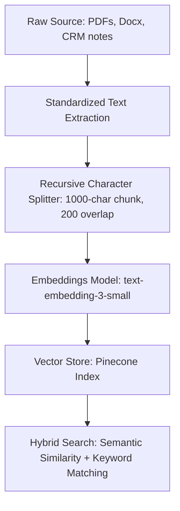

# LLM Prompting, RAG Best Practices, and Cost Monitoring (2026)

**Module 4: Tech Stack Build Guides and Examples**

## Why This Exists

In 2026, building AI systems is easy, but building *deterministic, cost-efficient, and production-grade* AI systems is difficult. Without proper architecture, LLM agents hallucinate data, fail to retrieve context, and run up massive API bills that destroy retainer margins.

This guide provides the foundational specifications for Prompt Engineering, Retrieval-Augmented Generation (RAG), and Token Cost Monitoring within your agency.

---

## 1. Prompt Engineering Standards (2026)

To ensure consistent performance from non-deterministic models, your prompt libraries must follow a strict structural hierarchy.

### The System Prompt Structure
Every system prompt must separate instructions, constraints, context, and output formatting rules using explicit XML tags. This prevents "prompt injection" and improves instruction adherence in modern models (like Claude and GPT-4o).

#### Example Schema:
```text
<system_role>
You are a routing agent for a local HVAC contractor. Your task is to extract call notes and categorize the urgency.
</system_role>

<instructions>
1. Review the input message in the <input_data> tag.
2. Evaluate if the message contains an emergency indicators (gas, fire, active water flooding).
3. Select one category from the approved list in <allowed_categories>.
</instructions>

<allowed_categories>
- EMERGENCY (immediate risk)
- SERVICE_REQUEST (normal scheduling)
- BILLING_INQUIRY (non-urgent)
</allowed_categories>

<constraints>
- Output ONLY valid JSON matching the schema in <output_schema>.
- Do NOT include any conversational text or explanation outside the JSON block.
</constraints>

<output_schema>
{
  "category": "EMERGENCY" | "SERVICE_REQUEST" | "BILLING_INQUIRY",
  "reasoning": "string"
}
</output_schema>
```

### Key Parameter Guidelines
* **Temperature Tuning:**
  * Use **`0.0` to `0.2`** for structural extraction, classification, data format mapping, and RAG search query generation.
  * Use **`0.7` to `1.0`** only for creative copywriting, drafting sales outbound follow-ups, and natural conversational agents.
* **Few-Shot Examples:** Always provide 2–3 examples of expected inputs and outputs within the prompt (few-shot prompting) when dealing with complex classification logic.

---

## 2. RAG (Retrieval-Augmented Generation) Architecture

RAG projects fail when garbage data is uploaded to vector databases, or when semantic retrieval retrieves irrelevant text chunks.



### Chunking Guidelines
* **Recursive Character Splitting:** Split files by paragraphs first, targeting a **chunk size of 1,000 characters** with an **overlap of 200 characters**. This maintains text context across chunk boundaries.
* **Metadata Tagging:** Always tag vector chunks with source documents, client IDs, and update dates. Use metadata filtering in n8n queries to restrict search pools.

---

## 3. Real-Time Token Cost Monitoring

Agentic loops (where models query databases, make tool calls, and review decisions) can execute 10–20 LLM runs per client request. Without telemetry, billing issues will go unnoticed.

### Monitoring Stack Integration
1. **LiteLLM Proxy:** Host a self-hosted LiteLLM container. Route all n8n AI nodes through the LiteLLM API endpoint instead of calling OpenAI/Anthropic directly.
2. **API Keys per Client:** Assign unique API keys inside LiteLLM for each client.
3. **Usage Logging:** Configure LiteLLM to push transaction logs to LangSmith or Helicone. This allows tracking token consumption, input vs. output usage, and total dollar cost per client in a dashboard.

---

## 4. Testing & Evaluation (Evals)

Do not deploy workflows to production without testing them against baseline test sets.

* **Golden Datasets:** Maintain a CSV sheet of 50–100 historical client emails/tickets with human-validated correct classifications.
* **Regression Testing:** Before editing an n8n system prompt, run your test dataset through the workflow. Ensure the classification accuracy matches or exceeds the baseline score.
* **HITL Safety Net:** If the LLM confidence score falls below 85% or if output schema validation fails, the system must trigger a fallback step routing the request to a human reviewer's dashboard.
