# End-to-End Client Journey Map

**Module 5: SOPs, Delivery Workflows, and QA**  
*High-level master flowchart and stage-gate process for consistent, high-quality delivery of AI automation and agentic systems in 2026.*

---

## Why This Exists

In 2026, successful AI Automation / Agent Agencies win through **repeatable systems**, not heroic one-off builds. Clients buy outcomes and ongoing reliability — not prompts, workflows, or “AI magic.” 

This map standardizes the full client delivery cycle so every engagement:
- Follows a predictable, stage-gated process with clear entry/exit criteria
- Builds in rigorous QA for non-deterministic outputs (hallucinations, edge cases, cost overruns)
- Supports **agentic orchestration** (multi-agent systems with memory, tools, RAG, and human-in-the-loop oversight)
- Transitions smoothly into high-margin **retainer relationships** instead of low-ticket freelance traps
- Protects both parties with explicit **data governance boundaries** at handoff
- Enables scaling beyond the founder by giving future team members or internal AI agents a shared playbook

Without a documented journey map, agencies suffer scope creep, inconsistent quality, support overload after “go-live,” and client churn. This file is the backbone that turns delivery into a productized, defensible operation.

---

## How to Use It

1. **Reference for every client** — Keep this file visible in your project management tool (Notion, ClickUp, or Linear).
2. **Customize per niche** — Replace generic examples with your vertical’s specific triggers, tools, and success metrics.
3. **Drive stage gates** — Do not advance to the next phase without documented sign-off (templates live in `/detailed-sops/` and `project-management-templates.md`).
4. **Feed internal automation** — Use this map to prompt your internal proposal drafter, research helper, or transcript summarizer agents (see `internal-agency-ops-prompts-and-sops.md`).
5. **Train & scale** — New contractors or future employees read this first.
6. **Iterate the map itself** — After every major engagement, run a retrospective and update this file.

---

## The End-to-End Client Journey Flowchart (2026 Agentic Model)

```mermaid
flowchart TD
    Start([Lead Accepted / Discovery Scheduled]) --> DC[Discovery Call<br/>1-2 sessions • Pain mapping • ROI hypotheses • Tool access review]
    
    DC --> Q1{Qualified &<br/>Budget/ Timeline Fit?}
    Q1 -->|No| Decline[Polite Decline or Nurture Sequence<br/>Add to content/lead magnet list]
    Q1 -->|Yes| Scope[Scoping & Proposal<br/>Detailed process map • Tech choices • Multi-agent design • Timeline • Exclusions • Pricing]
    
    Scope --> SOW[Signed SOW + Contract + DPA<br/>Clear IP ownership • Liability limits for non-deterministic outputs • Data residency clauses]
    
    SOW --> Dev[Development & Build<br/>n8n self-hosted workflows • Specialized agents + shared memory/RAG • HITL checkpoints • Secrets via env vars only]
    
    Dev --> IntQA[Internal QA Protocol<br/>• Hallucination & factual accuracy tests<br/>• Edge-case & failure-mode testing<br/>• Cost/token budget validation<br/>• Security / prompt-injection resistance<br/>• Regression suite on core paths]
    
    IntQA --> Pass1{Pass all<br/>gates?}
    Pass1 -->|No| Dev
    
    Pass1 -->|Yes| CUAT[Client UAT / Review Session<br/>Live walkthrough • Sample runs with real-ish data • Feedback capture]
    
    CUAT --> Pass2{Client<br/>Approved?}
    Pass2 -->|No / Minor| Dev
    Pass2 -->|Yes| Deploy[Deployment<br/>• Production n8n instance or client env<br/>• Monitoring & alerting setup<br/>• Rollback plan documented]
    
    Deploy --> Hand[ Handoff & Training<br/>• Recorded training session<br/>• Full documentation package<br/>• Access matrix & credential handover<br/>• Data governance boundaries enforced<br/>• Signed acceptance form]
    
    Hand --> Ret[Retainer Kickoff & First Review<br/>• Baseline metrics dashboard live<br/>• Optimization backlog prioritized]
    
    Ret --> Loop[Monthly Optimization Loop<br/>• Metrics report<br/>• Proactive recommendations<br/>• Controlled iterations & expansions<br/>• Continuous model/tool evaluation]
    
    Loop --> Ret
    
    classDef stage fill:#e0f2fe,stroke:#0369a1,stroke-width:2px,color:#0c4a6e
    classDef decision fill:#fef3c7,stroke:#d97706,stroke-width:2px,color:#92400e
    classDef success fill:#d1fae5,stroke:#059669,stroke-width:2px,color:#065f46
    classDef caution fill:#fee2e2,stroke:#dc2626,stroke-width:2px,color:#991b1b
    
    class DC,Scope,Dev,IntQA,CUAT,Deploy,Hand,Ret,Loop stage
    class Q1,Pass1,Pass2 decision
    class Decline caution
    class Start,Hand,Ret,Loop success
```

---

## Phase Summary Table

| Phase | Typical Duration | Key Activities | Primary Deliverables | Exit Criteria | Typical Tools |
|:---|:---|:---|:---|:---|:---|
| **Discovery Call** | 1–2 calls / 1 week | Pain mapping, process audit, access review | Discovery summary + rough ROI | Client confirms budget and pain points | Call recording + Notion/Airtable |
| **Scoping & Proposal** | 1–2 weeks | Process mapping, agent architecture, tech selection | Proposal + draft SOW | Signed SOW + DPA + deposit | Mermaid/Whimsical + SOW template |
| **Development & Build** | 2–6 weeks | n8n build, agents, RAG, HITL | Working MVP in staging | Internal QA gates all passed | Self-hosted n8n + templates |
| **Internal QA** | 3–7 days (overlaps Dev) | Hallucination/edge case testing, cost validation | QA report + bug/fix log | All gates green + regression suite green | Custom test metrics + cost monitor |
| **Client UAT** | 1 week | Walkthrough, test runs with client | Feedback log + revisions | Written client approval | Shared staging environment |
| **Deployment** | 2–5 days | Production setup, alerts, rollback plan | Production system live | Monitoring dashboards green | n8n production instance + alerts |
| **Handoff & Training** | 1 week | Asset/credential handover, recorded training | Signed handoff + training video | Client confirms operational ownership | Loom/Notion + password manager |
| **Retainer Loop** | Ongoing | Metrics review, optimization, expansion | Monthly ROI report + backlog | Client renews/expands retainer | Dashboard + n8n + audit tools |

---

## Data Governance Boundaries at Handoff

Handoff is the highest-risk moment for data exposure, scope disputes, and compliance violations. Maintain strict boundaries:

1. **Data Ownership:**
   * **Client Owns:** Production databases, credentials, logs, and outputs generated.
   * **Agency Retains:** Read-only monitoring logs (for duration of retainer only) to track errors and optimize token costs. 
   * **Agency Does Not Retain:** Raw personal identifiable information (PII) or long-term administrative root passwords on client infrastructure once the deployment completes.
2. **Access Provisioning:**
   * Rotate or transfer all API keys, OAuth tokens, and system accounts.
   * Revoke agency team members from client n8n instances or downgrade permissions to least-privilege view-only accounts.
   * Deliver all workflow source JSON files in an encrypted, password-protected archive.
3. **Compliance Requirements:**
   * Ensure execution history retention matches client GDPR/HIPAA policies.
   * Never hard-code production secrets; use Docker `.env` files or secure vaults.
