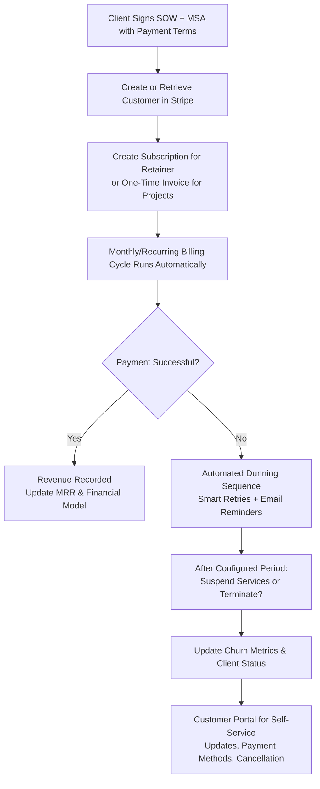

# Billing and Operations Setup for AI Automation Agencies

**⚠️ IMPORTANT DISCLAIMER — EDUCATIONAL USE ONLY — NOT FINANCIAL, LEGAL, OR TAX ADVICE ⚠️**

This document provides general guidance on billing operations, Stripe setup, basic accounting concepts, and insurance considerations for educational purposes within the **AI Agency Starter Kit 2026**. It is **not** financial, accounting, legal, tax, or insurance advice. Stripe features, tax rules, insurance products, and regulatory requirements vary by jurisdiction, change over time, and depend on your specific business facts.

**You must consult qualified professionals** (accountant, bookkeeper, attorney, and licensed insurance broker) before implementing any billing system, recognizing revenue, filing taxes, or purchasing insurance. Improper setup can lead to cash flow problems, tax penalties, compliance violations, or uninsured losses. The maintainers of this kit disclaim all liability arising from the use of this material. Results vary. Always validate with real clients and licensed professionals in your jurisdiction.

---

## Why This Exists

Sustainable AI Automation Agencies in 2026 run on **recurring retainer revenue**, not one-off projects. Reliable billing systems, predictable cash flow, accurate margin tracking (including variable AI/API costs), and proper risk protection through insurance are foundational to survival and scaling.

This file exists to help you:
- Set up professional recurring billing with Stripe (the recommended platform for most agencies) so retainers are invoiced automatically and reliably.
- Implement automated dunning to recover failed payments without manual chasing.
- Track true business performance with basic accounting tailored to AI work (retainer revenue vs. variable token/tool costs, project margins, churn).
- Protect the agency with Errors & Omissions (E&O / Professional Liability) insurance, which is especially important because of non-deterministic AI outputs, client reliance on automations, and potential downstream impacts.
- Operate securely and compliantly when handling payment-related data and integrations.

Poor billing and operations hygiene is one of the fastest ways early agencies run out of cash or get into disputes, even when delivery is strong.

---

## Stripe Recurring Billing Setup (Recommended for 2026 AI Agencies)

Stripe is the preferred platform for most AI automation agencies because of its excellent recurring billing (Subscriptions), automated dunning, Customer Portal (self-service updates/cancellations), usage-based billing capabilities, and strong developer experience. It also handles PCI compliance for you in most B2B scenarios.

### High-Level Billing Flow

### Step-by-Step Setup Guide

#### 1. Create / Verify Your Stripe Account
- Go to stripe.com and create an account (or log in).
- Complete account verification (business details, bank account for payouts, tax information).
- Enable Billing in the dashboard if not already active.
- **[CUSTOMIZE FOR YOUR NICHE]:** If you serve international clients, enable additional currencies and payment methods early.

#### 2. Set Up Products and Prices
In Stripe Dashboard $\rightarrow$ Products $\rightarrow$ Create a Product for each tier.
Recommended structure for AI agencies:

| Product Name | Type | Pricing Model | Typical Use Case |
|:---|:---|:---|:---|
| **Discovery / Audit** | One-time | Fixed price | Initial audit or scoping engagement |
| **Implementation Project** | One-time | Fixed or milestone | Build & deploy phase |
| **Operations Retainer** | Recurring | Monthly subscription | Ongoing monitoring, optimization, support |
| **Usage / Token Buffer** | Metered | Usage-based | Pass-through or buffered API costs |

- For retainers: Create a recurring Price (e.g., $2,500/mo, billed monthly in advance).
- For projects: Use one-time Prices or Invoice with line items / milestones.
- Enable Customer Portal so clients can update payment methods, view invoices, and cancel or pause subscriptions.

#### 3. Create Customers and Subscriptions
- When a client signs an SOW, create a Customer record in Stripe.
- Create a Subscription linked to the Retainer Product/Price.
- Best practice: Invoice in advance for retainers.
- Use Stripe Checkout or Invoicing for one-time project work.

#### 4. Configure Automated Dunning
- Go to Settings $\rightarrow$ Billing $\rightarrow$ Dunning.
- Customize retry schedule (e.g., immediate retry, then +3 days, +7 days, +14 days).
- Set up email sequences for failed payments (professional, branded templates).
- Define what happens after final failure: automatically cancel subscription or mark as unpaid.

#### 5. Set Up Webhooks (Critical for Automation)
- Create a webhook endpoint in your backend or use a service like n8n to listen for events:
  - `invoice.payment_succeeded`
  - `invoice.payment_failed`
  - `customer.subscription.updated`
  - `customer.subscription.deleted`
- **Security Requirement:** Always verify the `Stripe-Signature` header on incoming webhooks to prevent spoofing. Never trust raw webhook payloads.

#### 6. Go Live & Test Thoroughly
- Use Stripe's **Test Mode** with mock credit cards (e.g., `4242...`) to simulate successful payments, failed payments, and dunning sequences before charging real clients.

---

## Basic Accounting Concepts for AI Agencies

To track your true business profitability, you must understand your monthly unit economics, separating fixed recurring income from variable delivery costs.

### Key Metrics to Monitor
1. **MRR (Monthly Recurring Revenue):** The sum of all active client retainers. Do not include one-time implementation setup fees here.
2. **Variable API COGS (Cost of Goods Sold):** The monthly total of all LLM API tokens, vector databases, and SaaS tools directly attributable to client delivery.
3. **Gross Margin %:** Target $\ge 65\%$ on retainers:
   $$\text{Gross Margin \%} = \frac{\text{Retainer Revenue} - \text{Variable API \& Tool COGS}}{\text{Retainer Revenue}} \times 100$$
4. **LTV (Lifetime Value):** The total revenue expected from a single client before they churn:
   $$\text{LTV} = \frac{\text{Average Monthly Retainer Revenue}}{\text{Monthly Churn Rate}}$$
5. **CAC (Customer Acquisition Cost):** The total sales and marketing spend divided by the number of clients acquired.

### Cash vs. Accrual Accounting
- **Cash Basis:** Records revenue when cash is received and expenses when paid. Simplest for solo operations.
- **Accrual Basis:** Records revenue when earned (e.g., when the project milestone is delivered) and expenses when incurred. Mandatory as you scale and hire contractors.

---

## Errors & Omissions (E&O) & Cyber Insurance

In 2026, AI agencies operate at high risk due to the non-deterministic nature of LLMs. If an automated customer agent hallucinates pricing data, or if a scheduling agent double-books a contractor crew causing loss of business, the client may hold your agency liable.

### 1. Errors & Omissions (E&O) / Professional Liability
* **Why it is mandatory:** Protects your agency against claims of negligence, software failure, incorrect AI advice, and integration errors.
* **Coverage Targets:** Secure a policy covering **$1,000,000 to $2,000,000** in liability limits.
* **AI Specific Riders:** Speak with your broker to ensure the policy does not contain general exclusions for "generative AI outputs" or "algorithmic decisions."

### 2. Cyber Liability Insurance
* **Why it is mandatory:** Deploying self-hosted databases and handling customer data exposes you to data breach risk. Cyber insurance covers notification costs, forensics, and legal defense if your n8n server or credentials are compromised.

---

## Operational Launch Checklist

- [ ] **Stripe Account:** Activated and verified with linked business bank account.
- [ ] **Billing Products:** Created for Audit, Build, and Retainer tiers.
- [ ] **Webhooks Secured:** Signature validation active on n8n staging and production endpoints.
- [ ] **Legal Footer:** Terms of Service and Privacy Policy linked in Stripe invoices and customer portal.
- [ ] **Insurance Active:** E&O and Cyber Liability policy certificates secured.
