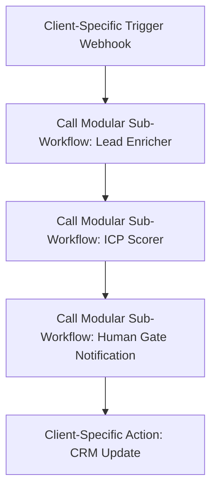

# Agency Scaling Principles (2026)

**Module 8 | Team, Hiring, Scaling, and Future**  
*AI Agency Starter Kit 2026*

## Why This Exists

Scaling an AI Automation Agency in 2026 does not mean multiplying human headcount. True scaling is about expanding the **volume of active retainers** and the **value delivered to clients** while keeping the agency's human overhead extremely lean. 

This guide details the core principles of leveraged execution, schema standardization, asynchronous communication, and centralized monitoring required to scale operations sustainably.

---

## 1. Modular n8n Sub-Workflows & Reusability

If you build every client automation from scratch, your margins will decay as you add clients. Profitability relies on **Code Reusability**.

### The Sub-Workflow Pattern
- **Decouple Triggers and Actions:** Keep triggers (webhooks, email pollers) and actions (CRM updates, Slack alerts) in separate client-specific wrappers. 
- **Centralize Core Logic:** Route the complex reasoning, data cleaning, and API calls through n8n **Sub-Workflows** (using the *Execute Workflow* node).
- **Benefits:**
  - If an API schema changes or a prompt needs optimization, you only update it once in the sub-workflow, instantly updating all client implementations using that module.
  - Reduces development time for new clients by up to 70%.

---

## 2. Standardization of Data Schemas

To maintain reusable sub-workflows, you must enforce a **Standard Internal Data Schema** across all projects.

* **Translation Layer (Intake):** Translate raw incoming client payloads into your standard JSON schema at the entry point of the workflow.
* **Standard Schemas:**
  - *Leads Schema:* `{"first_name": "", "last_name": "", "email": "", "company": "", "value": 0}`
  - *Support Ticket Schema:* `{"ticket_id": "", "subject": "", "customer_email": "", "extracted_urgency": ""}`
* **Translation Layer (Handoff):** Map your standard output JSON schema to the client's target CRM properties at the final action node. This ensures your core AI analysis nodes never need custom variables for individual client software setups.

---

## 3. Centralized Monitoring & Alerting at Scale

When managing 10+ client retainers running on self-hosted VPS servers, manual error checking is impossible. You need a centralized dashboard.

1. **Error Trigger Webhooks:** Configure n8n's **Error Trigger** globally. Any node failure across any client workflow automatically sends a payload to a central *Agency Ops* workflow.
2. **Centralized Slack/Teams Alerting:** Group error notifications in an internal Slack channel (`#ops-alerts`) detailing:
   - Client Name
   - Workflow ID
   - Failed Node & Error Message
   - Link to execution history for debugging
3. **Execution Volume & Token Caps:** Implement weekly token usage rollups (using LiteLLM logs). Alert the team if a client's workflow executes 3x their standard daily average, catching runaway loops or prompt attacks early.

---

## 4. Asynchronous Culture & Communication

In a lean team (Founder + Contractor + Delivery Lead), meetings are an operational tax. Establish async-first rules:

* **No Status Update Meetings:** All project updates live in the internal Notion project board (`project-management-templates.md`).
* **Loom Walkthroughs:** Developers document completed builds or bug fixes using 3-minute Loom videos with transcripts rather than booking sync calls.
* **Structured Decision Logs:** Document architectural changes, tool replacements, or client scope modifications in a central "Decision Log" database with owners, dates, and rationale.

---

## 5. Maximizing Value per Human Hour (VPHH)

Track this primary agency health metric:
$$\text{VPHH} = \frac{\text{Total Monthly Retainer Revenue}}{\text{Total Human Hours Logged on Delivery and Support}}$$

Your scaling goal is to steadily increase this ratio by substituting human hours with reusable workflow assets and internal AI agents. If VPHH declines as you add clients, it indicates your builds are too custom or your monitoring routines are too manual. Re-evaluate your productization boundaries immediately.
