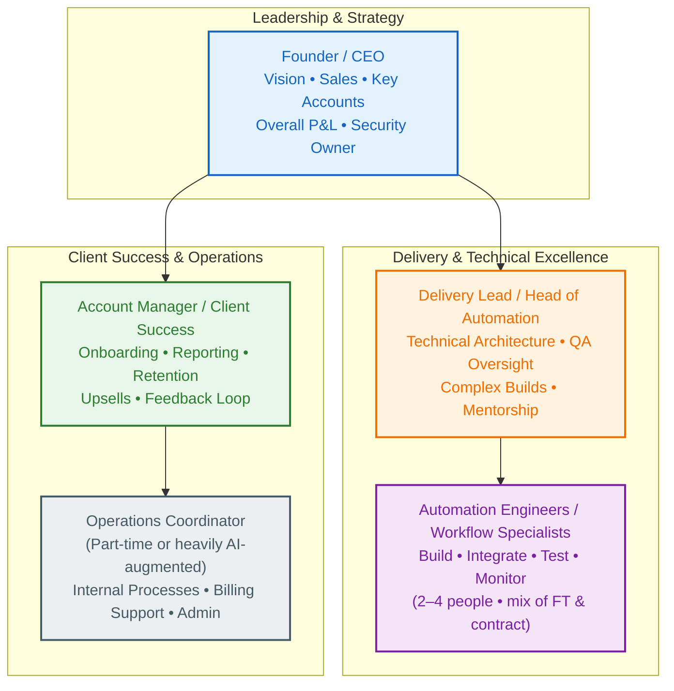

# Small Team Org Chart: From Solo Founder to Lean, Scalable AI Agency

**Module 8 | Team, Hiring, Scaling, and Future**  
*AI Agency Starter Kit 2026*

## Why This Exists

In 2026, the highest-performing AI Automation Agencies do **not** scale by adding large teams of junior staff. They scale by combining niche expertise, productized retainer services, and **agentic orchestration** — small groups of senior humans who design, govern, and continuously optimize fleets of specialized AI agents and workflows.

This file gives you a deliberate, low-risk growth roadmap:
- **Stage 1**: Solo founder (heavy internal AI augmentation)
- **Stage 2**: Founder + targeted contractor capacity
- **Stage 3**: Lean multi-person structure (typically 3–7 humans managing significant AI/agent capacity)

The philosophy is simple: **document everything, productize relentlessly, protect client data with rigorous access controls, and only add humans when systems and revenue clearly justify it**. Premature or unstructured hiring is one of the fastest ways to erode margins, quality, and founder sanity.

This structure directly supports recurring revenue, measurable client ROI, and sustainable leverage while embedding security from day one.

---

## How It Connects to Other Sections

- **Inputs from**: `02_Business_Planning_and_Model/financial-model-template.md` (headcount cost modeling and break-even), `05_SOPs_Delivery_Workflows_and_QA/` (detailed SOPs and QA protocols used for training), `07_Legal_Compliance_Operations/` (contractor agreements, NDAs, DPAs, and data governance clauses).
- **Feeds into**: `job-descriptions-and-interview-questions.md` (role summaries, JDs, and tests), `hiring-vs-outsource-vs-productize-decision-framework.md` (headcount decision matrix), `scaling-principles.md` (long-term leverage and capacity modeling).

---

## Planned Growth Stages & Milestones

### Stage 1: Solo Founder (Foundation Phase)
You handle sales, discovery, scoping, architecture, building, QA, deployment, reporting, and client success — heavily augmented by internal AI agents for research, drafting, monitoring, proposal generation, and routine tasks (see `internal-agency-ops-prompts-and-sops.md` under Module 5).

**Typical duration**: First 6–12+ months while validating the model.

**When to seriously consider moving to Stage 2:**
- Consistent retainer MRR covers a contractor cost + 3–6 month buffer.
- You are spending the majority of time on high-leverage work (sales, strategy) or experiencing clear burnout on repeatable delivery.
- Core processes are documented, tested, and repeatable.

### Stage 2: Founder + Contractor Developer / Automation Specialist
Add your first external capacity focused purely on technical execution and implementation.
* **Role split:** Founder retains ownership of sales, client relationships, discovery, scoping, strategy, and security. Contractor executes builds, integrations, testing, and documentation.

### Stage 3: Lean Multi-Person Agency Structure (Target Operating Model)
A small senior team (typically 3–7 humans) that designs and governs significant AI/agent capacity across many clients.

---

## Role-Based Access Control (RBAC) Protocols

Security and client trust are foundational. Follow least privilege and separation of duties at every stage.

| Role | n8n Projects | GitHub / Code Repo | Internal Docs | LLM APIs & Vector Stores | Stripe / Billing | Client Data / PII |
|:---|:---|:---|:---|:---|:---|:---|
| **Founder / Admin** | Full access across all projects | Owner / Admin | Full access | Full (key rotation owner) | Full admin | Full with audit logging |
| **Delivery Lead** | Admin/Editor on delivery projects; Viewer elsewhere | Maintain / Write | Edit relevant SOPs & templates | Scoped credentials per project | View relevant reports | Read + limited edit (assigned clients) |
| **Automation Engineer** | Editor only in assigned client projects | Write via feature branches + PRs | Read + comment on SOPs | Project-specific credentials only | No access | Read-only for assigned workflows |
| **Account Manager** | Viewer only (no workflow edits) | Read-only | Edit client-facing reports | Read-only usage analytics | View client invoices | Read client summaries only |
| **Contractor (temporary)** | Editor in specific project(s) only; auto-revoke | Limited PRs / code review only | Read-only relevant sections | Temporary scoped credentials | No access | Minimal / anonymized where feasible |

### Core RBAC Implementation Protocols
1. **Project Isolation (n8n):** One Project per major client. Never mix everything in a single global workspace.
2. **Credential Hygiene:** Store all secrets in n8n Credentials (or external secret manager). Never hardcode secrets in workflows or commit them to Git.
3. **Access Lifecycle:**
   * *Onboarding:* Signed NDA + DPA + security training $\rightarrow$ staged access (read-only first) $\rightarrow$ full scoped access after review.
   * *Offboarding:* Immediate revocation checklist (disable n8n user, remove GitHub access, rotate relevant credentials, confirm no lingering sessions).
