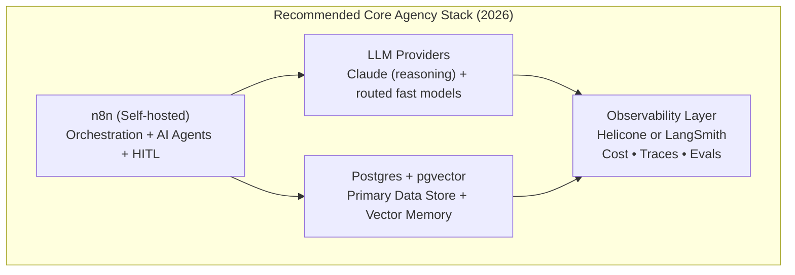

# Curated Tool List 2026

**A Living Directory of Recommended Software for AI Automation & Agent Agencies**

*Module 9: Resources, Community, and Updates | AI Agency Starter Kit 2026*

> **Security & Compliance Note (Critical)**: Every tool listed is a third-party service or open-source project. **Always review the current Terms of Service, Privacy Policy, Data Processing Agreement (DPA), AI usage policies, and compliance certifications** before connecting to client data, PII, regulated information, or production workflows.

---

## Why This Exists

In 2026 the winning AI agencies are not the ones with the flashiest demos — they are the ones that reliably deliver measurable outcomes (time saved, error reduction, revenue impact) through **agentic orchestration** (multi-agent systems with memory, tools, RAG, and human-in-the-loop oversight) while maintaining healthy, predictable margins on retainers.

Tool choice directly determines your productized service profitability, variable cost visibility (tokens, queries), and data privacy controls.

---

## Default Recommended Core Stack for Most New Agencies (Mid-2026)

* **Orchestration:** n8n (self-hosted)
* **Memory / Retrieval:** pgvector on Postgres or Supabase
* **Reasoning:** Intelligent routing between Claude (complex agent tasks) and faster/cheaper models
* **Observability & Cost Control:** Helicone or LangSmith

---

## Workflow Orchestration & Agent Platforms

| Tool | Key Strengths for AI Agencies (2026) | Approx. Pricing | Deployment | Best Suited For |
|:---|:---|:---|:---|:---|
| **n8n (Primary)** | Mature AI Agent nodes, LangChain integration, visual + code hybrid. Excellent for complex agentic loops with HITL. | Self-host: infra only ($5–$100+/mo). Cloud: usage-based. | Docker Compose, n8n Cloud, Railway/Render | Most retainer work, custom multi-agent systems, internal automation. |
| **Make.com** | Visual builder for complex branching scenarios, solid AI modules. | Paid plans ~$9–$29+/mo scaling by usage. | Cloud | Teams that prefer pure visual/low-code or non-agentic workflows. |
| **Zapier** | Easiest entry point, massive app ecosystem. | Task-based pricing; expensive at volume. | Cloud | Very simple automations or as a lightweight bridge layer. |
| **Activepieces** | Open-source n8n-style alternative. | Self-host free; Cloud options. | Docker or Cloud | Budget-conscious or fully open-source stacks. |

---

## Large Language Models (LLMs) & Inference Providers

| Provider / Family | Key Strengths for Agencies | Approx. Pricing | Access / Deployment | Notes |
|:---|:---|:---|:---|:---|
| **Anthropic Claude** | Superior reasoning, tool calling, agentic behavior, safety. | ~$3–$15+/M tokens (caching available) | API | Often preferred for complex multi-step agent workflows. |
| **OpenAI (GPT series)** | Mature ecosystem, function calling, broad tooling, Azure path. | Usage-based | API or Azure OpenAI | Strong all-rounder with excellent JSON mode. Azure for enterprise compliance. |
| **Google Gemini** | Multimodal, long context, Google Workspace integration. | Usage-based | API or Vertex AI | Excellent when Workspace data is involved. |
| **Fast Inference (Groq, Together.ai)** | Extremely low latency and cost. | Very low per-token pricing | Serverless API | Use for cost optimization in high-volume, simple routing tasks. |
| **Local / Self-hosted (Ollama, vLLM)** | Maximum privacy and zero per-token cost after infra. | Infrastructure cost only | Self-host on VPS/GPU | Best for highly sensitive data or high-volume margin protection. |

---

## Vector Databases & Retrieval Infrastructure

| Tool | Key Strengths (2026) | Approx. Pricing | Deployment | Best Agency Fit |
|:---|:---|:---|:---|:---|
| **pgvector (Postgres)** | ACID guarantees, SQL interface, no extra system to manage. default starting point. | Free on Postgres | Self-host or managed (Supabase/Neon) | Default choice for typical agency RAG and memory workloads. |
| **Pinecone** | Fully managed serverless, excellent DX, easy scaling, hybrid search. | Serverless query-based | Managed Cloud | Clients needing hands-off scale and security certifications. |
| **Weaviate** | Native hybrid search (vector + keyword + rich filters), GraphQL. | Self-host free; Cloud usage-based | Docker or Cloud | Workflows needing complex metadata filtering. |
| **Qdrant** | High performance (Rust), cost-effective, excellent filtering. | Self-host free; Cloud usage plans | Self-host or Cloud | Performance-sensitive production workloads where Postgres is too slow. |

---

## Observability, Cost Monitoring & Evaluation Tools

| Tool | Primary Value for Agencies | Key Features | Pricing | Deployment |
|:---|:---|:---|:---|:---|
| **Helicone** | LLM gateway + observability proxy. | Cost dashboards, caching, rate limiting, sessions | Usage-based (generous free tier) | Proxy layer |
| **LangSmith** | Deep tracing for agentic workflows, evaluation datasets. | Tracing, evals, datasets, cost/latency dashboards | Usage-based | SaaS |
| **Langfuse** | Open-source observability for LLM apps. | Sessions, traces, evals, cost analytics | Self-host free; Cloud usage | Self-host or Cloud |
| **Arize Phoenix** | Open-source tracing + evaluation focused on RAG. | Tracing, RAG evals, embeddings visualization | Open source (free) | Self-host |
